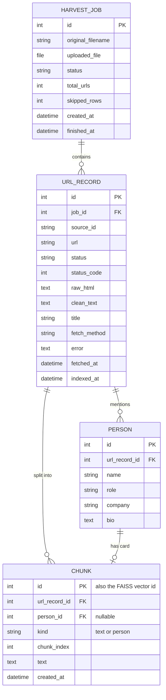

# Database Design

Two stores:
- **SQLite** (`data/db.sqlite3`): source of truth for jobs, raw content, people and chunk text.
- **FAISS** (`data/faiss.index`): vectors only, each identified by `Chunk.id`.

## 1. ER diagram

## 2. Tables

### harvest_harvestjob
| Field | Type | Notes |
|---|---|---|
| id | AutoField PK | |
| original_filename | CharField(255) | |
| uploaded_file | FileField | stored under `media/uploads/` |
| status | CharField(16) | `pending`, `running`, `done` |
| total_urls | PositiveInteger | valid URLs after dedupe |
| skipped_rows | PositiveInteger | empty or invalid rows |
| created_at / finished_at | DateTime | finished_at nullable |

### harvest_urlrecord
| Field | Type | Notes |
|---|---|---|
| id | AutoField PK | |
| job | FK HarvestJob, CASCADE | index |
| source_id | CharField(64), null | `ID` column from the file |
| url | URLField(2048) | |
| status | CharField(16) | `pending`, `fetching`, `fetched`, `indexed`, `failed`; index |
| status_code | SmallInteger, null | HTTP status |
| raw_html | TextField | unmodified response body |
| clean_text | TextField | extracted readable text |
| title | CharField(512) | |
| fetch_method | CharField(16) | `requests` / `playwright` |
| error | TextField, blank | |
| fetched_at / indexed_at | DateTime, null | |

Constraint: `unique_together (job, url)`. The same URL can appear in different jobs.

### knowledge_person
| Field | Type | Notes |
|---|---|---|
| id | AutoField PK | |
| url_record | FK UrlRecord, CASCADE | |
| name | CharField(255) | index |
| role | CharField(255) | |
| company | CharField(255) | index |
| bio | TextField | |

### knowledge_chunk
| Field | Type | Notes |
|---|---|---|
| id | AutoField PK | used as FAISS id |
| url_record | FK UrlRecord, CASCADE | |
| person | FK Person, SET_NULL, null | set when kind = person |
| kind | CharField(8) | `text`, `person`; index |
| chunk_index | PositiveInteger | order within the page |
| text | TextField | exact text that was embedded |
| created_at | DateTime | |

## 3. SQLite to FAISS mapping
- Index type: `IndexIDMap(IndexFlatIP(384))`, vectors L2-normalized so inner product = cosine similarity.
- `faiss_id == Chunk.id`. No separate mapping table is needed.
- Search returns `(id, score)` pairs; ids are resolved with one `Chunk.objects.filter(id__in=...)` query.
- Deleting chunks (re-ingest or cascade) must call `VectorStore.remove(ids)` first. A `pre_delete`
  signal is not used for bulk deletes, so ingest removes vectors explicitly.
- Orphans (ids in FAISS without a Chunk) are ignored at query time and cleaned by `rebuild_index`.

## 4. Rebuild
`python manage.py rebuild_index`: reset index, iterate all Chunks in batches of 256, embed, add, save.
Use it after changing the embedding model or if the index file is lost.

## 5. Size notes
Raw HTML pages can be 100 KB to 1 MB each. SQLite handles this fine at assignment scale;
the API paginates and can omit `raw_html` to keep responses small.
