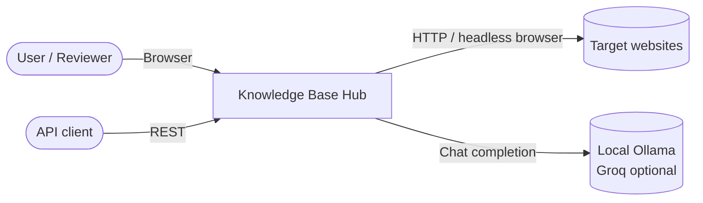
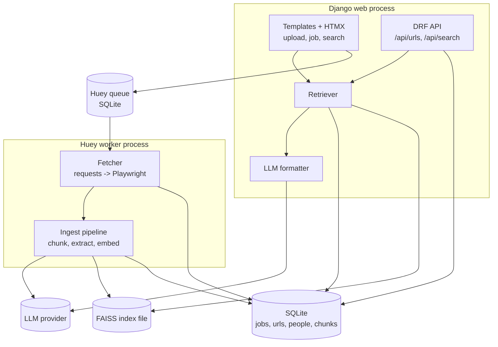

# High-Level Design

## 1. Purpose
Convert a list of URLs (CSV/XLSX) into a searchable knowledge base focused on people:
executives, roles and biographies. Data is persisted in a relational store (SQLite) for
inspection and in a vector store (FAISS) for semantic search.

## 2. Scope
In scope: file upload, scraping, raw storage, chunking, person extraction, embeddings,
semantic search UI with LLM-formatted results, REST API.
Out of scope: authentication, multi-tenant data, crawling beyond the given URLs, scheduled re-harvesting.

## 3. System context

## 4. Component architecture

| Component | Responsibility |
|---|---|
| Upload UI | Accept file, validate, create job, enqueue fetch tasks |
| Fetcher | Download page, fallback to Playwright, extract clean text |
| Ingest pipeline | Chunk text; extract people via the LLM and, opportunistically, via schema.org JSON-LD (ADR-010) when a page embeds it; embed, write to FAISS |
| SQLite | Source of truth: raw HTML, status, people, chunk text |
| FAISS | Vectors only, keyed by `Chunk.id` |
| Retriever | Embed query, search FAISS, resolve chunks, boost person chunks |
| LLM formatter | Turn retrieved chunks into `{answer, people[]}` JSON |
| REST API | Expose harvested URLs, jobs and search |

## 5. Key design choices
Summarised here; full reasoning in `DECISIONS.md`.
- **Two-level retrieval:** raw text chunks plus one "person card" chunk per extracted person.
- **SQLite as source of truth:** FAISS can always be rebuilt from the Chunk table.
- **Background processing:** Huey with a SQLite broker keeps setup to zero extra services.
- **Local LLM by default:** Ollama runs the model on the machine; Groq is an optional switch.

## 6. Non-functional requirements
| Area | Target |
|---|---|
| Responsiveness | Upload returns < 2 s; search < 15 s with a local 3B model on CPU (< 5 s with Groq) |
| Resilience | One failing URL never fails the job; LLM failure falls back to raw chunks |
| Persistence | SQLite and FAISS survive restarts; index rebuildable by command |
| Scale | Designed for tens to low hundreds of URLs on one machine |
| Portability | Runs on Windows, macOS, Linux with Python 3.11 |
| Security | Secrets in `.env`; uploaded files validated by type and size; URLs limited to http/https |
| Observability | Structured logs for fetch, ingest and LLM calls with ids |

## 7. Deployment view
Single machine: Ollama service plus two app processes (Django server, Huey worker) sharing `data/`:
`db.sqlite3`, `huey.db`, `faiss.index`. The embedding model is downloaded once and cached
by sentence-transformers.

## 8. Risks
| Risk | Mitigation |
|---|---|
| Sites block scrapers (403) | Browser UA, Playwright fallback, record the failure |
| JS-rendered pages return empty shells | Text-length check triggers Playwright |
| LLM returns invalid JSON or hallucinates | JSON-only prompt, schema validation, context-only instruction, source links |
| Concurrent FAISS writes | Single ingest worker or file lock in VectorStore |
| Large raw HTML in API responses | Pagination and `include_html=false` |
