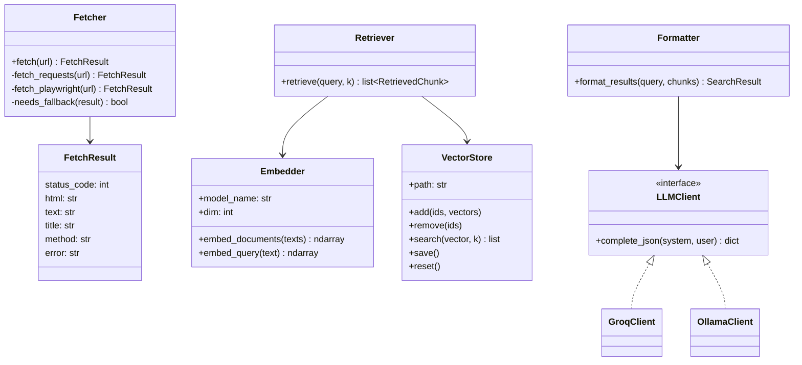

# Low-Level Design

## 1. Module map
```
harvest/
  models.py      HarvestJob, UrlRecord
  forms.py       UploadForm
  parsers.py     parse_url_file()
  fetcher.py     fetch(), FetchResult
  tasks.py       fetch_url()
  views.py       upload_view, job_detail_view, job_rows_partial, job_list_view, _records()
knowledge/
  models.py      Person, Chunk
  chunker.py     chunk_text()
  embedder.py    Embedder
  vector_store.py VectorStore
  extractor.py   extract_people(), PersonData
  structured_data.py extract_json_ld_people() (schema.org Person via JSON-LD, ADR-010)
  tasks.py       ingest_url()
  management/commands/rebuild_index.py
search/
  llm.py         LLMClient, get_llm()
  retriever.py   retrieve(), RetrievedChunk
  formatter.py   format_results(), SearchResult
  views.py       search_view
api/
  serializers.py UrlRecordSerializer, HarvestJobSerializer, SearchRequestSerializer
  views.py       UrlRecordViewSet, HarvestJobView, SearchAPIView
  urls.py
  exceptions.py  exception_handler() -- unhandled exceptions -> {"detail": "Internal error."}
```

## 2. Class diagram


## 3. Function contracts

### harvest/parsers.py
```python
def parse_url_file(file) -> ParseResult:
    """Read CSV or XLSX. Returns ParseResult(urls: list[ParsedUrl], skipped: int).
    ParsedUrl(source_id: str | None, url: str). Detects URL column case-insensitively,
    validates http/https, strips whitespace, dedupes preserving order.
    Raises InvalidFileError if no URL column is found."""
```

### harvest/fetcher.py
```python
def fetch(url: str) -> FetchResult:
    """requests first (browser UA, FETCH_TIMEOUT_SECONDS, FETCH_MAX_RETRIES).
    Falls back to Playwright if status in {403, 429} or len(text) < MIN_TEXT_CHARS
    and PLAYWRIGHT_FALLBACK is on. Never raises; errors go into FetchResult.error."""
```
Text extraction: `trafilatura.extract(html, include_tables=True)`; if that returns
nothing, BeautifulSoup `get_text(" ", strip=True)` after removing script/style/nav/footer.

### harvest/tasks.py
```python
@huey.task(retries=0)
def fetch_url(record_id: int) -> None:
    """Load UrlRecord, call fetch(), save fields, set status fetched|failed,
    enqueue ingest_url(record_id) on success, update job counters."""
```

### knowledge/chunker.py
```python
def chunk_text(text: str, title: str, size: int, overlap: int) -> list[str]:
    """Split on paragraphs, then pack into ~size tokens (approx 4 chars/token)
    with overlap. Prefix every chunk with "[{title}] "."""
```

### knowledge/embedder.py
```python
class Embedder:
    """Process-wide singleton (lazy load). bge query prefix:
    'Represent this sentence for searching relevant passages: '."""
    def embed_documents(self, texts: list[str]) -> np.ndarray  # float32, L2-normalized
    def embed_query(self, text: str) -> np.ndarray              # shape (dim,)
```

### knowledge/vector_store.py
```python
class VectorStore:
    """Wraps faiss.IndexIDMap(faiss.IndexFlatIP(dim)). Loads from path if present.
    Writes guarded by a threading/file lock; save() after each add/remove batch."""
    def add(self, ids: list[int], vectors: np.ndarray) -> None
    def remove(self, ids: list[int]) -> None
    def search(self, vector: np.ndarray, k: int) -> list[tuple[int, float]]
```

### knowledge/extractor.py
```python
def extract_people(text: str, company_hint: str) -> list[PersonData]:
    """Send up to ~12k chars per call (split long pages, merge by name).
    Validate each item has name and role; drop invalid ones; dedupe by lowercased name."""
```
`company_hint` is `UrlRecord.title`, falling back to the URL's domain (`urlparse(url).netloc`)
when there's no title, so extraction still has some company context on titleless pages.
Prompt (system): *Extract every person described on this page. Return JSON only:
{"people":[{"name":"","role":"","company":"","bio":""}]}. Use only the text given.
If none, return {"people":[]}.*

### knowledge/tasks.py
```python
@huey.task()
def ingest_url(record_id: int) -> None:
    """1. Delete old Chunks/Persons for the record and remove their vectors.
    2. extract_json_ld_people(raw_html) -- cheap, deterministic, no LLM call (ADR-010).
    3. chunk_text -> Chunk(kind='text').
    4. extract_people(clean_text) -- the LLM path. Merge with the JSON-LD people,
       deduped by lowercased name; the JSON-LD version wins on a collision.
    5. Person + Chunk(kind='person', text='Name, Role, Company. Bio') for the merged list.
    6. Embed all new chunks, VectorStore.add(chunk ids), save.
    7. Set record status 'indexed'. On extractor failure, keep text chunks and log."""
```

### search/retriever.py
```python
def retrieve(query: str, k: int | None = None) -> list[RetrievedChunk]:
    """k defaults to settings.SEARCH_TOP_K, resolved inside the function body
    rather than as a literal default (avoids evaluating settings at import time).
    Embed query, FAISS search k, load Chunks (select_related url, person),
    score += PERSON_BOOST for kind='person', sort desc, return.

    IndexFlatIP.search() always returns up to k results with no relevance
    floor -- it happily returns the closest available vectors even when
    nothing in the index is truly relevant. Deciding "not found" is
    format_results()'s job, not retrieve()'s."""
```

### search/formatter.py
```python
def format_results(query: str, chunks: list[RetrievedChunk]) -> SearchResult:
    """Build numbered context from top SEARCH_CONTEXT_CHUNKS, each with its source URL.
    Ask LLM for {"answer": str, "people": [{name, role, company, summary, source_url}]}.
    The prompt requires "answer" to always be a non-empty sentence (a direct answer or
    an explicit not-found statement) and "people" to include only entries directly
    relevant to the question, not everyone mentioned in the context -- format_results()
    does not filter people in code, it passes through whatever the LLM returns.
    Validate; an empty/whitespace-only "answer" is treated as invalid too, regardless
    of what the model returned. On any failure return SearchResult(llm_ok=False,
    chunks=chunks). SearchResult.chunks is always the full input chunks list, not just
    the context slice sent to the LLM -- true on both the success and failure paths."""
```

### search/llm.py
```python
def get_llm() -> LLMClient  # chosen by LLM_PROVIDER (default "ollama")
class LLMClient:
    def complete_json(self, system: str, user: str, timeout: int = LLM_TIMEOUT_SECONDS) -> dict
    # strips ``` fences, json.loads, raises LLMError on failure

class OllamaClient(LLMClient):
    # POST {OLLAMA_BASE_URL}/api/chat
    # body: {"model": OLLAMA_MODEL, "format": "json", "stream": false,
    #        "options": {"temperature": 0},
    #        "messages": [{"role":"system",...}, {"role":"user",...}]}
    # reads response["message"]["content"]
    # ConnectionError -> LLMError("Ollama not reachable; run `ollama serve`")

class GroqClient(LLMClient):
    # groq SDK, response_format={"type": "json_object"}, temperature 0
```

## 4. Task and status flow
`UrlRecord.status`: `pending -> fetching -> fetched -> indexed`, or `failed` from fetching/ingest.
`HarvestJob.status`: `pending -> running -> done`; `done` when every record is indexed or failed.

## 5. Configuration
All tunables come from settings, loaded from `.env` (see `.env.example`):
embedding model and dimension, chunk size and overlap, top-k, context size, person boost,
LLM provider and model, fetch timeouts, retries, fallback flag, min text length,
`HUEY_WORKERS` (consumer thread count, default 1 so FAISS writes stay serialized).

Logging and API error handling are configured directly in `config/settings.py`
(`LOGGING`, and `REST_FRAMEWORK["EXCEPTION_HANDLER"]`), not via `.env` -- see §6.

## 6. Error handling
| Where | Failure | Behaviour |
|---|---|---|
| Upload | Bad type/size/no URL column | Form error, no job |
| Fetch | Network error, 4xx/5xx | Record `failed` + error; job continues |
| Ingest | LLM extraction fails | Log; text chunks still indexed |
| Ingest | Embedding/FAISS error | Record `failed`; no partial vectors saved |
| Search | LLM fails / bad JSON | Show raw chunks with notice |
| Search | Empty index | "Nothing indexed yet" message |
| HTML views | Unknown URL / unhandled view exception | `templates/404.html` / `templates/500.html` (friendly page, no traceback; only rendered when `DEBUG=False`) |
| API | Unhandled exception in an api/ view | `api/exceptions.py`'s custom DRF exception handler returns `500 {"detail": "Internal error."}`; the real exception is logged server-side via `logger.exception()`, never in the response body |
