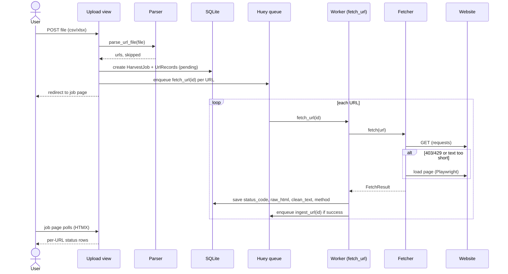
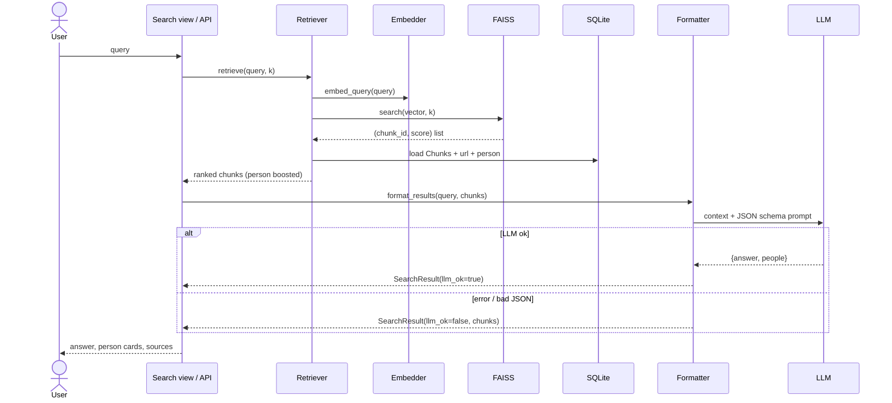
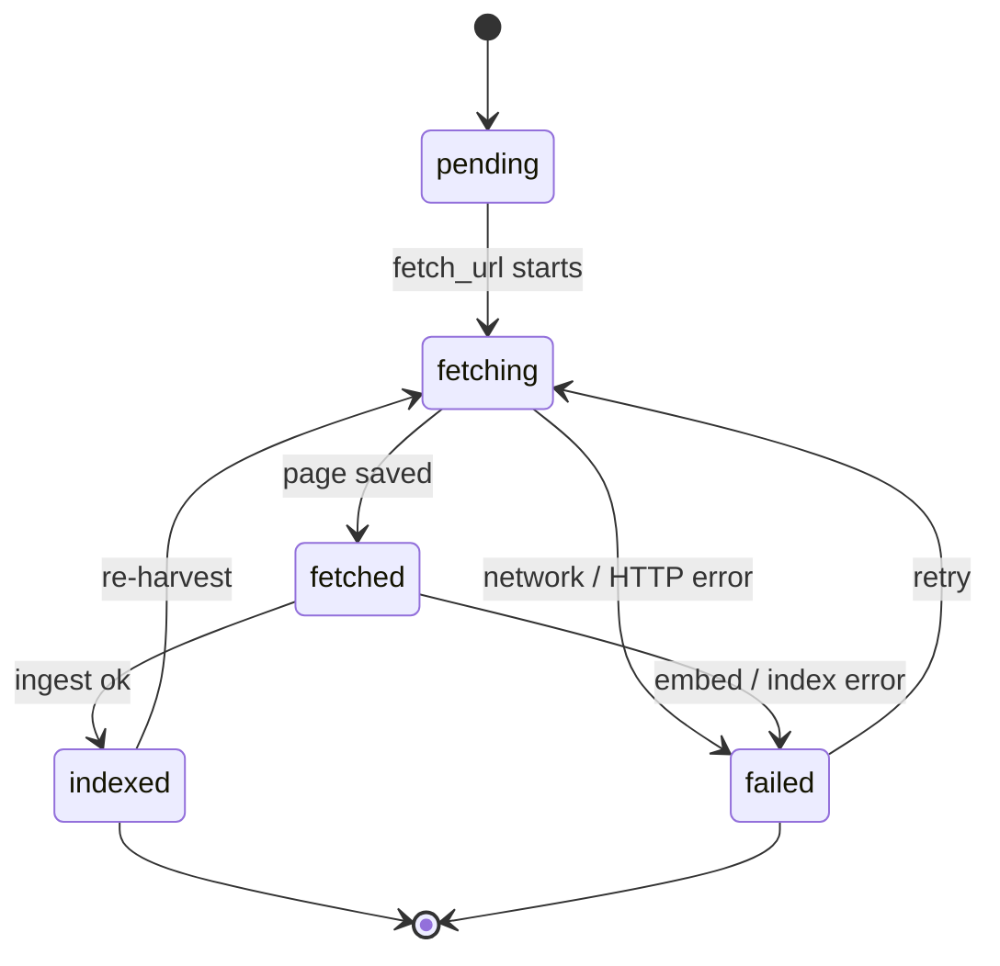
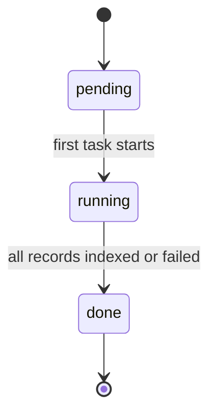

# Workflows

## 1. Upload and harvest


## 2. Ingest into the knowledge base
```mermaid
sequenceDiagram
  participant Q as Huey queue
  participant I as Worker (ingest_url)
  participant DB as SQLite
  participant J as JSON-LD parser
  participant C as Chunker
  participant X as Extractor
  participant L as LLM
  participant E as Embedder
  participant VS as FAISS

  Q->>I: ingest_url(id)
  I->>DB: load UrlRecord, old chunk ids
  I->>VS: remove(old ids)
  I->>DB: delete old Chunks/Persons
  I->>J: extract_json_ld_people(raw_html)
  J-->>I: PersonData list (schema.org Person, ADR-010; no LLM call)
  I->>C: chunk_text(clean_text)
  C-->>I: text chunks
  I->>X: extract_people(clean_text)
  X->>L: JSON extraction prompt
  L-->>X: {"people": [...]}
  X-->>I: PersonData list
  Note over I: merge JSON-LD + LLM people, deduped by<br/>lowercased name; JSON-LD wins on a collision
  I->>DB: save Persons, text + person Chunks
  I->>E: embed_documents(chunk texts)
  E-->>I: vectors
  I->>VS: add(chunk ids, vectors), save()
  I->>DB: status = indexed
```

## 3. Search


## 4. UrlRecord state


## 5. HarvestJob state

